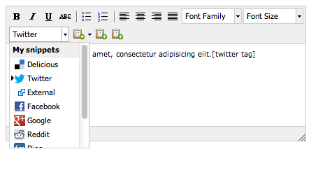
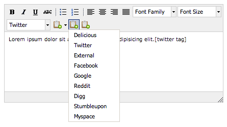
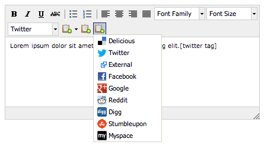
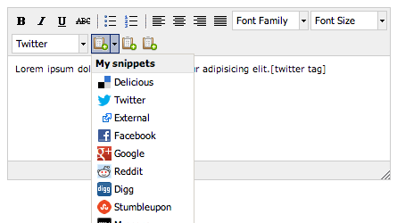

# TinyMCE Snippet plugin

TinyMCE Snippet plugin lets you create a custom button or dropdown menu for inserting personalized snippets of text or code from an external source (like json) into the editor.

See the [live demo](http://giugee.com/demo/tinymce-snippet-plugin/).

This plugin works with TinyMCE version 3.x.

Four different buttons are available:

* dropdown menu `snippetlistbox`

* normal dropdown button `snippetmenubtn`

* normal dropdown button with icons `snippetmenubtnicon`

* dropdown button that inserts the last selected value on click `snippetsplitbtn`

It is also possible to personalize the menu through stylesheet and icons.

## Configuration

To use the plugin is necessary to put the *snippet* folder into the *plugins* folder in TinyMCE, load it

	plugins : "snippet"

then retrieve the list of snippets previously definied in javascript

	snippet_list : data

and insert the preferred button

	theme_advanced_buttons2 : "snippetlistbox,snippetsplitbtn,snippetmenubtn,snippetmenubtnicon"

## Data format

The data source is an array of objects containing three properties:

* `title`: name of the snippet that will appear in the menu
* `value`: string of text that will be inserted in the editor
* `cls`: class name of the menu item for personalized style

		var data = [
			{ title: "Delicious",	value: "[delicious tag]",	cls: "delicious"   },
			{ title: "Twitter",		value: "[twitter tag]",		cls: "twitter"     },
			{ title: "External",	value: "[external tag]",	cls: "external"    },
			{ title: "Facebook",	value: "[facebook tag]",	cls: "facebook"    },
			{ title: "Google",		value: "[google tag]",		cls: "google"      },
			{ title: "Reddit",		value: "[reddit tag]",		cls: "reddit"      },
			{ title: "Digg",		value: "[digg tag]",		cls: "digg"        },
			{ title: "Stumbleupon",	value: "[stumbleupon tag]",	cls: "stumbleupon" },
			{ title: "Myspace",		value: "[myspace tag]",		cls: "myspace"     }
		];